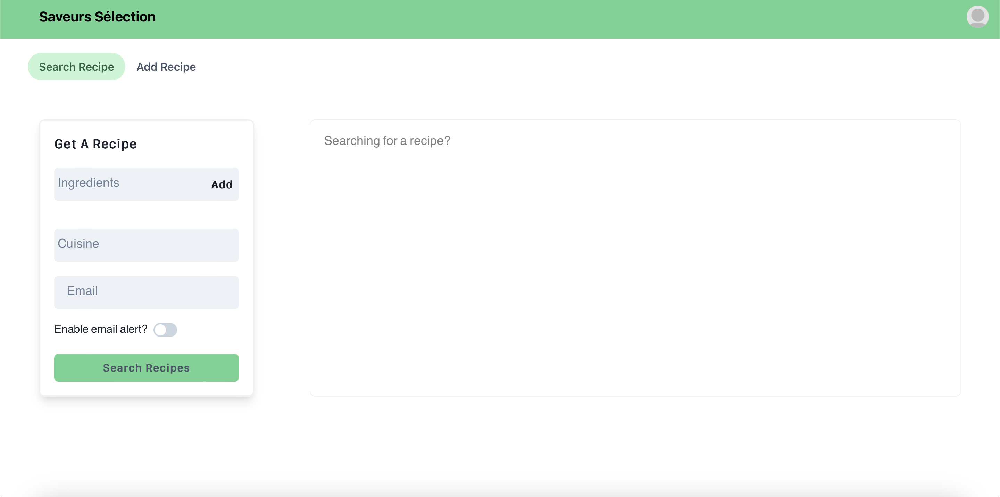
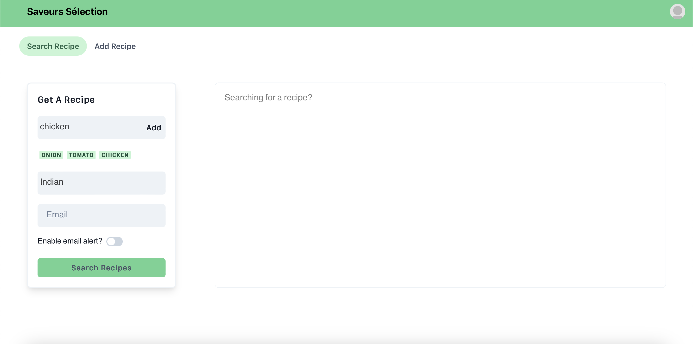
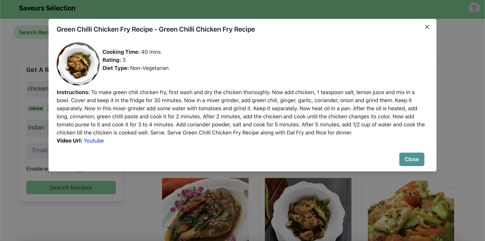
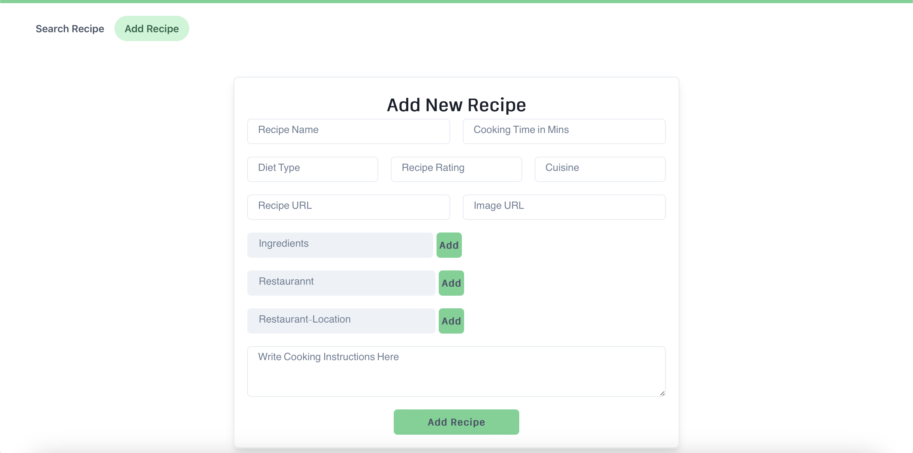

## SaveursSélection Demo Video (Deltas explained):

https://user-images.githubusercontent.com/44945317/143974192-4947e6c7-da20-4491-aa54-06bc1ff85335.mp4

## SaveursSélection: Find, Cook, Taste, Share 🍔


[](https://www.javascript.com/)
[](https://zenodo.org/doi/10.5281/zenodo.10023534)
[](https://github.com/shubham-wawale/Recipe_Recommender/issues)
[](https://badgen.net/github/stars/shubham-wawale/Recipe_Recommender)

[](https://app.travis-ci.com/shubham-wawale/Recipe_Recommender)
[](https://codecov.io/gh/het-patel99/Recipe_Recommender)
[](https://github.com/shubham-wawale/Recipe_Recommender/actions/workflows/Respost.yml)
[](https://github.com/het-patel99/Recipe_Recommender/actions/workflows/codeFormatter.yml)

[](https://github.com/shubham-wawale/Recipe_Recommender/actions/workflows/Code_Formatter_and_Syntax_Check.yml)
[](https://github.com/shubham-wawale/Recipe_Recommender/actions/workflows/coverage.yml)
[](https://github.com/shubham-wawale/Recipe_Recommender/actions/workflows/Style_Checker_and_Prettify_Code.yml)
[](https://github.com/shubham-wawale/Recipe_Recommender/actions/workflows/greetings.yml)

[](https://github.com/shubham-wawale/Recipe_Recommender/actions/workflows/stale.yml)


https://user-images.githubusercontent.com/43135408/143961045-e86b0aef-c4ca-41bd-b242-00cd7973038e.mp4

   <h3>🍔 Our motto: Find, Cook, Taste, Share 🍔</h3>

  <p>
    Introducing "SaveursSélection", your ultimate culinary companion! Say goodbye to the hassle of pondering what to prepare with the ingredients on hand. We've revolutionized the way you approach cooking by crafting an application that effortlessly suggests delectable recipes based on the ingredients you have readily available in your kitchen.

Unleash the potential of your pantry and refrigerator by allowing our innovative software to guide you in selecting the perfect dishes that match your current ingredient inventory. Cooking is no longer a daunting task; it's a delightful adventure waiting to happen. Dive into the world of endless culinary possibilities with our Recipe Recommender
  </p>

## Documentation

Recipe Recommender is a website that suggests users simple food recipes based on ingredients provided.

- [ ] The interface can take multiple ingredients from user as an input.
- [ ] The interface can also takes the type of cuisine the user wants.
- [ ] For each recipe, we show the key ingredients, instructions and a sample image.
- [ ] Upon user request we also send the list of recipes to the user.

Source documentation can be found at: [Recipe Recommender Docs] https://github.com/shubham-wawale/Recipe_Recommender/blob/master/docs/Recipe%20Recommender%20Source%20Documentation.pdf
[Restaurant Recommender Docs] https://github.com/shubham-wawale/Recipe_Recommender/blob/master/docs/Restaurant_Recommendation.pdf

## Technology Stack


## Key Software Requirements

- [Node.js v18.17.1](https://nodejs.org/en/download/)
- [NPM v10.1.0](https://nodejs.org/en/download/)

## Project Setup Steps:

### Installation:

- clone repository using `git clone https://github.com/shubham-wawale/Recipe_Recommender.git`
- setup for frontend
  open terminal and navigate to the **frontend** folder and execute the following:
  ```
  npm install
  ```
- setup for backend
  open terminal and navigate to the **backend** folder and execute the following:

  ```
  npm install
  ```

  ## Execution Steps

1.  start backend server using:
    ```
    npx nodemon
    ```
2.  start frontend server using:
    ```
    npm start
    ```
3.  Automatically a browser window is opened which shows frontend.
4.  run `npm test` for running the tests [Dependencies: Jest, Chai, Supertest]

### IDE and Code Formatter

- [Visual Studio Code](https://code.visualstudio.com/) IDE
- [Prettier Formatter for Visual Studio Code](https://github.com/prettier/prettier-vscode/blob/main/README.md)

## Work Flow

<table border="2" bordercolorlight="#b9dcff" bordercolordark="#006fdd">

  <tr style="background: #010203;"> 
    <td valign="left">
     <p style="color: #FF7A59"> Current Home Page
      </p>
      <a href="./images/current_stage1.png">
         
      </a> 
    </td> 
    <td valign="left">
     <p style="color: #FF7A59"> Previous Home Page
      </p>
     <a href="./images/previous_stage1.png">
         
      </a> 
    </td> 
  </tr>

   <tr style="background: #010203;"> 
    <td valign="left">
     <p style="color: #FF7A59">  
      </p>
      <a href="./images/current_stage2.png">
         
      </a> 
    </td> 
    <td valign="left">
     <p style="color: #FF7A59">
      </p>
     <a href="./images/previous_stage2.png">
         
      </a> 
    </td> 
  </tr>

  <tr style="background: #010203;"> 
    <td valign="left">
     <p style="color: #FF7A59">  
      </p>
      <a href="./images/current_stage3.png">
         
      </a> 
    </td> 
    <td valign="left">
     <p style="color: #FF7A59">
      </p>
     <a href="./images/previous_stage3.png">
         
      </a> 
    </td> 
  </tr>

  <tr style="background: #010203;"> 
    <td valign="left">
     <p style="color: #FF7A59">  
      </p>
      <a href="./images/current_stage4.png">
         
      </a> 
    </td> 
    <td valign="left">
     <p style="color: #FF7A59">
      </p>
     <a href="./images/previous_stage4.png">
         
      </a> 
    </td> 
  </tr>
    
 </table>
 <table>
    <tr style="background: #010203;"> 
    <td valign="left">
     <p style="color: #FF7A59">  Add Recipe Page
      </p>
      <a href="./images/current_stage5.png">
         
      </a> 
  </tr>
 </table>

## Roadmap

### Phase 3: Completed Tasks:

- [x] Added more filters and also recommend restaurants to users based on their inputs.
- [x] Added vegeterian/vegan filters, etc.
- [x] Hosted database on MongoDB server for better availability.
- [x] Added additional dataset to recommend restaurant as per the desired cuisine.
- [x] Made the webpage publicly available by hosting the website on AWS and reduced the down time to 0.
- [x] Added filter for rating recipe.
- [x] Dockerized the application.
- [x] Fine tuned the existing code and wrapped up to produce a finished product.
- [x] Changed email format of the recipe suggestions.
- [x] Added cooking time filter.
- [x] Improved the code test coverage by adding more specialized test cases.
- [x] Added demo video which shows how the user will interact with our software.
- [x] Added document for Phase-3 Improvements : https://github.com/het-patel99/Recipe_Recommender/blob/master/docs/Phase%203%20Improvements.pdf

## :page_facing_up: License <a name="License"></a>

This project is licensed under the terms of the MIT license. Please check [License](https://github.com/PvPatel-1001/Recipe_Recommender/blob/master/LICENSE) for more details.

## :pencil2: Contributions <a name="Contributions"></a>

Please see our [CONTRIBUTING.md](https://github.com/shubham-wawale/Recipe_Recommender/blob/master/CONTRIBUTING.md) for instructions on how to contribute to the project by completing some of the issues.

## Contributors Phase - 3

<table>
  <tr>
    <td align="center"><a href="https://github.com/aj0671"><br /><sub><b>Atharva Joshi</b></sub></a></td>
    <td align="center"><a href="https://github.com/shubham-wawale/"><br /><sub><b>Shubham Wawale</b></sub></a><br /></td>
    <td align="center"><a href="https://github.com/sal0ni"><br /><sub><b>Sahil Purohit</b></sub></a><br /></td>
    <td align="center"><a href="https://github.com/Sahil-18"><br /><sub><b>Shinit Shetty</b></sub></a><br /></td>
  </tr>
</table>

<p align="center">Made with ❤️ on GitHub.</p>
